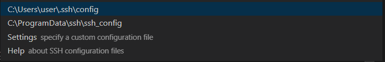

## VScode colab ssh 원격접속(Windows)


1. cloudflare.exe 파일 다운로드 

    * 다운로드 링크 : (https://developers.cloudflare.com/argo-tunnel/getting-started/installation)

2. vscode 실행 후, EXTENSIONS에서 Remote-SSH설치 

3. 설치후 (crtl + shift + p)를 눌러 Remote-SSH : Open Configuration File... 선택. 

    

    C:\\Users\\username\\.ssh\\config 선택

    config 파일을 다음과 같이 수정

    ```
    Host *.trycloudflare.com
    HostName %h
    User root
    Port 22
    ProxyCommand C:\\cloudflared.exe access ssh --hostname %h  
    ```
    ProxyCommand의 cloudflared.exe 파일의 절대경로를 입력. 저장위치마다 상이할수 있음(c드라이브 바로 아래 둬야 에러가 나지 않는다는 의견이 있음. 또한 절대경로의 "\\" 가 2개있어야 된다고 함.)

4. Google colab을 실행 후 새 노트북을 열고 다음의 코드를 입력

    ```
    !pip install colab-ssh

    from colab_ssh import launch_ssh_cloudflared, init_git_cloudflared
    launch_ssh_cloudflared(password="PUT_YOUR_PASSWORD_HERE")
    ```

5. 4번 코드 실행 후 나오는 VScode remote SSH 의 결과 Copy 

6. VScode로 돌아와 (ctrl + shift + p) 누른 후 Remote-SSH : Connect to Host 선택 후 아까 복사한 코드 붙여넣기

7.  새로운 VScode가 실행되면 os 선택창의 Linux 선택. 비밀번호 입력 후 colab 사용 


---

* 개이적인 에러 이슈

    * 초기 config 파일 수정 중 Host 앞에 Copy가 붙여져있는데 지워야지 되는거 같다.

    * colab에서 내 드라이브를 마운트 하고 난 뒤 원격접속을 해야 내 드라이브가 보인다는데 게속 안보이다가 어떻게 하다 보니 연결됨. 마운트 시킨 다음에 연결 했었는데도 안되었다가 갑자기 실행되는게 이해가 잘 안됐음.
